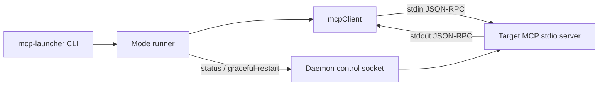

# mcp-launcher

[](https://github.com/thebtf/mcp-launcher/actions/workflows/ci.yml)
[](https://pkg.go.dev/github.com/thebtf/mcp-launcher)
[](https://goreportcard.com/report/github.com/thebtf/mcp-launcher)
[](LICENSE)
[](#requirements)

`mcp-launcher` is a zero-dependency Go CLI for exercising stdio MCP servers
without opening a full AI client. It starts a target server as a subprocess,
performs the MCP initialize flow, keeps a real stdio owner alive, and can probe
tools, resources, daemon restarts, reconnects, and binary upgrade paths from the
command line.

Use it when a server behaves differently under a real stdio client than it does
under a hand-written unit test.

## Quick Start

Install with Go:

```bash
go install github.com/thebtf/mcp-launcher@latest
```

Or build from source:

```bash
git clone https://github.com/thebtf/mcp-launcher.git
cd mcp-launcher
go test ./...
go build .
```

Start a live MCP stdio session against your server:

```bash
mcp-launcher -binary ./my-mcp-server -mode hold -hold 600
```

Call a tool and print both the raw MCP response and decoded text payload:

```bash
mcp-launcher \
  -binary ./my-mcp-server \
  -mode tool \
  -tool sessions \
  -args '{"action":"health"}'
```

Read an MCP resource:

```bash
mcp-launcher \
  -binary ./my-mcp-server \
  -mode resource \
  -uri my-server://health
```

## Why This Exists

Manual server launches hide client lifecycle bugs. A real stdio MCP client owns
stdin, reads stdout line-by-line, handles notifications while waiting for
responses, sends `notifications/initialized`, and may disconnect or reconnect at
awkward times.

`mcp-launcher` gives you that pressure without the rest of an AI application:

- Reproduce restart handoff failures with an actual subprocess owner.
- Verify that `tools/list`, `tools/call`, and `resources/read` work after the
  initialize handshake.
- Exercise daemon control sockets while the stdio client is still connected.
- Check that deferred binary installs become visible before reconnect
  verification starts.
- Switch between full inherited environment and a clean allow-list environment
  that still preserves lifecycle-critical EOF policy when set.
- Run a profile-aware compatibility audit that separates generic MCP behavior
  from Claude Code-style and Codex-style launch envelopes.

## Requirements

- Go 1.22 or newer.
- A target MCP stdio server binary.
- No runtime dependencies beyond the Go standard library.
- A daemon control socket only for `test`, `phase2`, `persist`, and
  `kill-reconnect` modes.

Windows, macOS, and Linux are supported for stdio launch flows. The
`-cleanup-binary-processes` helper is Windows-only.

## Commands

```text
mcp-launcher -binary <server> [options] [-- extra server args...]
```

### Modes

| Mode | What it does |
| --- | --- |
| `hold` | Starts the server, completes MCP initialization, and keeps the session open for external testing. |
| `call` | Calls any JSON-RPC method after initialization. |
| `tool` | Calls an MCP tool through `tools/call`. |
| `resource` | Reads an MCP resource through `resources/read`. |
| `install` | Calls the server's `upgrade` tool with a local source binary, closes stdio, reconnects, and verifies health. |
| `test` | Starts a daemon, connects one owner session, sends one graceful restart over the control socket, and checks the successor daemon. |
| `phase2` | Runs two graceful restarts: original daemon, then successor daemon. Useful for handoff deadlock repros. |
| `persist` | Verifies that a daemon survives stdio disconnect and that the next session reuses the same daemon PID. |
| `kill-reconnect` | Hard-kills the daemon, closes stdio, then measures new-session recovery time. |
| `compat` | Runs a profile-aware MCP stdio compatibility audit and optionally writes a JSON report. |

### Flags

| Flag | Default | Description |
| --- | --- | --- |
| `-binary` | required | MCP server executable path. |
| `-cwd` | `.` | Working directory for the subprocess. |
| `-mode` | `hold` | One of `hold`, `call`, `tool`, `resource`, `install`, `test`, `phase2`, `persist`, `kill-reconnect`, or `compat`. |
| `-hold` | `300` | Seconds to keep the session open in `hold` mode. |
| `-watch` | `60` | Seconds to watch daemon liveness after disconnect in `persist` mode. |
| `-ctl` | empty | Daemon control socket path. Required for `test`, `phase2`, `persist`, and `kill-reconnect`. |
| `-daemon-flag` | `--muxcore-daemon` | Flag used to start the target server in daemon mode. |
| `-env-mode` | `full` | `full` passes the parent environment; `clean` forwards a platform allow-list and preserves aimux/muxcore smoke contract variables when set. |
| `-timeout` | `120` | MCP request timeout in seconds, including initialize and `tools/list`. |
| `-compat-level` | `standard` | Compatibility audit breadth: `smoke`, `standard`, `lifecycle`, or `maximum`. |
| `-compat-profiles` | `generic,claude-code,codex` | Comma-separated profiles for `compat`: `generic`, `claude-code`, `codex`, `fixture`, `openclaw-registry`, or `hermes`. Reserved profiles return evidence-needed results until backed by docs or traces. |
| `-compat-report` | empty | Writes the compatibility audit JSON report to the provided path. |
| `-expect-tools` | `0` | Expected `tools/list` count after session init. `0` disables the check. |
| `-expect-version` | empty | Expected MCP `serverInfo.version` after session init. |
| `-method` | empty | JSON-RPC method for `call` mode. |
| `-params` | `{}` | JSON params for `call` mode. |
| `-tool` | empty | MCP tool name for `tool` mode. |
| `-args` | `{}` | JSON object arguments for `tool` mode. |
| `-uri` | empty | MCP resource URI for `resource` mode. |
| `-source` | empty | Local source binary for `install` mode. |
| `-force` | `false` | Sends `force=true` to `upgrade(action=apply)` in `install` mode. |
| `-upgrade-mode` | `auto` | Upgrade mode passed to the server: `auto`, `hot_swap`, or `deferred`. |
| `-install-validation` | `replacement` | Install proof strategy: `replacement` waits for `-binary` to change when a post-exit install is scheduled; `active-pointer` waits for an active pointer file to change and then verifies reconnect health/version. |
| `-active-engine-file` | empty | Active pointer file for `-install-validation active-pointer`; defaults to `MCPMUX_ACTIVE_ENGINE_FILE`. |
| `-reconnect-delay` | `2` | Initial/retry delay for install reconnect verification. Explicit values override the automatic post-exit reconnect delay, not replacement detection. |
| `-cleanup-binary-processes` | `false` | After a one-shot mode, kill remaining Windows processes with the same image name as `-binary`. Use only with unique smoke-test binary names. |

Everything after `--` is forwarded to the target server:

```bash
mcp-launcher -binary ./my-mcp-server -mode hold -- --config ./dev.json
```

## Common Workflows

### Keep a real owner session alive

```bash
mcp-launcher -binary ./my-mcp-server -mode hold -hold 600
```

This is the simplest way to keep stdin/stdout ownership active while another
tool triggers a restart or inspects daemon state.

### Probe a tool

```bash
mcp-launcher \
  -binary ./my-mcp-server \
  -mode tool \
  -tool sessions \
  -args '{"action":"health"}' \
  -expect-tools 27
```

`-expect-tools` turns the post-initialize `tools/list` count into an assertion.

### Probe a resource

```bash
mcp-launcher \
  -binary ./my-mcp-server \
  -mode resource \
  -uri my-server://health
```

### Run a compatibility audit

```bash
mcp-launcher \
  -binary ./my-mcp-server \
  -mode compat \
  -compat-level standard \
  -compat-report compat-report.json
```

The default audit runs `generic`, `claude-code`, and `codex` profiles. Results
stay separated so a server can pass generic MCP checks while a named host
envelope reports `FAIL`, `BLOCKED`, or `UNSUPPORTED`.

Compatibility levels are cumulative:

| Level | Use when |
| --- | --- |
| `smoke` | You only need startup and MCP initialize proof. |
| `standard` | You want the default local compatibility matrix. |
| `lifecycle` | You also want lifecycle checks that need `-ctl`. Missing inputs are `BLOCKED`. |
| `maximum` | You want all currently known checks, including install-source prerequisites. Missing inputs are `BLOCKED`. |

Reserved profiles such as `fixture`, `openclaw-registry`, and `hermes` do not
guess behavior. They return an evidence-needed result until primary docs or a
captured fixture trace exists.

### Verify a deferred binary install

```bash
mcp-launcher \
  -binary ./my-server-current.exe \
  -cwd /path/to/server/project \
  -mode install \
  -source ./my-server-next.exe \
  -force \
  -upgrade-mode auto \
  -expect-version 1.2.3
```

By default, `install` mode fingerprints the installed binary, calls `upgrade`,
closes the install session, waits for post-exit replacement when the payload or
disconnect indicates one is scheduled, reconnects, calls
`sessions(action="health")`, and tries to read `aimux://health` when that
resource exists.

For muxcore active-pointer/successor installs where the stable `-binary` path is
intentionally not replaced, use active-pointer validation:

```bash
mcp-launcher \
  -binary ./my-server-current.exe \
  -cwd /path/to/server/project \
  -mode install \
  -source ./my-server-next.exe \
  -force \
  -install-validation active-pointer \
  -active-engine-file ./active.txt \
  -expect-version 1.2.3
```

Active-pointer validation reads the pointer before `upgrade`, waits for it to
change after handoff, then treats reconnect health, tool count, and expected
version as the install proof. With `-env-mode clean`, the launcher still
preserves aimux/muxcore smoke contract variables from the parent environment,
including `AIMUX_STDIN_EOF_POLICY` and `MCPMUX_ACTIVE_ENGINE_FILE`.

### Verify daemon persistence across stdio disconnect

```bash
mcp-launcher \
  -binary ./my-server \
  -mode persist \
  -ctl /tmp/my-server.ctl.sock \
  -watch 60
```

`PASS` means the daemon PID stayed alive for the full watch window and the
second session reattached to the same PID.

## Architecture Overview



The project is intentionally small:

- `main.go` contains the CLI, stdio JSON-RPC client, daemon control socket
  client, mode runners, install reconnect logic, and cleanup helpers.
- `mcpClient` starts the target subprocess, writes JSON-RPC requests to stdin,
  reads newline-delimited JSON-RPC from stdout, routes responses by request ID,
  and collects notifications separately.
- `controlSend` talks to a raw Unix domain control socket for daemon status and
  graceful restart commands.
- `main_test.go`, `install_reconnect_test.go`, and `env_test.go` cover client
  cleanup on tool errors, Windows PID fallback cleanup, clean environment
  preservation, install reconnect delay decisions, post-exit install detection,
  replacement waiting, and binary fingerprinting.

## MCP Session Flow

Each session follows this sequence before the selected mode does its work:

```text
launcher -> server: initialize
server   -> launcher: initialize result with serverInfo
launcher -> server: notifications/initialized
launcher -> server: tools/list
server   -> launcher: tools/list result
```

After that, mode-specific work runs against the same live subprocess session.

## Troubleshooting

### `error: -binary is required`

**Symptom:** The launcher exits immediately with usage text.

**Cause:** `-binary` is the only required flag for every mode.

**Fix:** Pass the target MCP stdio server executable:

```bash
mcp-launcher -binary ./my-mcp-server -mode hold
```

**Verify:** The output includes `spawn`, `pid=`, `initialize`, and `tools`.

### `error: -ctl is required`

**Symptom:** `test`, `phase2`, `persist`, or `kill-reconnect` exits before
starting.

**Cause:** Those modes need the daemon control socket.

**Fix:** Pass the socket path used by your daemon:

```bash
mcp-launcher -binary ./my-mcp-server -mode phase2 -ctl /tmp/my-server.ctl.sock
```

**Verify:** The mode can print daemon status or restart results.

### `timeout waiting for initialize` or `timeout waiting for tools/list`

**Symptom:** The subprocess starts, but the launcher times out during bootstrap.

**Cause:** The target server did not emit a JSON-RPC response on stdout before
the timeout.

**Fix:** Run the target binary directly and check that stdout is reserved for
MCP JSON-RPC. Logs should go to stderr. Increase `-timeout` only after checking
that the server is actually starting.

**Verify:** `mcp-launcher -binary ./my-mcp-server -mode hold -timeout 120`
prints an initialize result and a tools count.

### Install mode reconnects too early

**Symptom:** `install` mode reports that reconnect verification failed after an
upgrade that schedules replacement after process exit.

**Cause:** The old process may need time to exit and replace the installed
binary.

**Fix:** Let the automatic post-exit wait run, or choose an explicit delay:

```bash
mcp-launcher \
  -binary ./my-server-current.exe \
  -mode install \
  -source ./my-server-next.exe \
  -reconnect-delay 15
```

**Verify:** The output shows either `installed binary changed` or a successful
`sessions health` payload.

### `cleanup-binary-processes` removed the wrong process

**Symptom:** A process with the same executable name as the smoke binary was
terminated.

**Cause:** Cleanup matches by image name on Windows.

**Fix:** Use `-cleanup-binary-processes` only with unique disposable binary
copies, such as `my-server-smoke-current.exe`.

**Verify:** No unrelated process shares the same image name before enabling the
flag.

## Development

```bash
go test ./...
go vet .
go build .
```

The module has no third-party dependencies. See [CONTRIBUTING.md](CONTRIBUTING.md)
for the contributor workflow.

## Repository Setup Notes

Suggested GitHub description:

```text
MCP stdio launcher for restart, reconnect, resource, tool, and upgrade smoke tests.
```

Suggested topics:

```text
mcp, model-context-protocol, go, cli, devtools, testing, stdio, json-rpc, graceful-restart, smoke-testing
```

## License

MIT. See [LICENSE](LICENSE).
